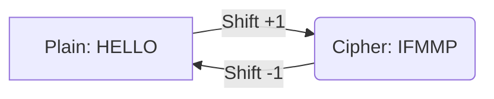
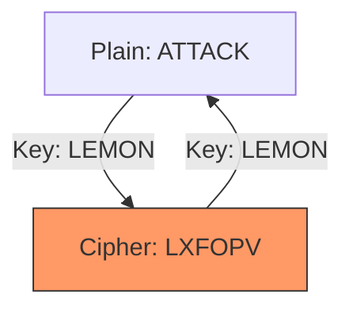

# **LAB 01 – CLASSROOM EDITION: THE CIPHER JOURNEY**

**Topic:** Classical Cryptography (Caesar, Vigenère, Substitution) & Security Principles.

**Goal:** Explore historic encryption tools, understand their weaknesses, and reflect on real-world security principles.

**Tools Required:** `FrequencyAnalyzer.html`

---

## **Step 1: The Roman Messenger (Caesar Cipher)**

**Story Context:**
> You are a messenger for Caesar carrying a message through enemy territory. The enemy can read Latin, so you must **Shift** the letters. If captured, you must NOT reveal the key (Shift Amount), even if they bribe you. Your Key is determined by your "Legion ID" (Student ID).

**Visual Concept:**

### **1.1 Identity Parameters**
1.  **Plaintext:** `[YourFullName] is learning security`
2.  **Key (Shift):** Last Digit of your Student ID (If 0, use 10).

### **1.2 The Encryption**
1.  Open `FrequencyAnalyzer.html` -> Tab **"Caesar"**.
2.  Enter your **Plaintext** and **Shift**.
3.  Record the Ciphertext.

---

## **Step 2: The Diplomatic Cable (Vigenère Cipher)**

**Story Context:**
> You are a Diplomat sending a cable to HQ. The simple Caesar Shift was broken last week. HQ issued a "Code Book" (Keyword). You must add the keyword to your message to scramble the frequencies.

**Visual Concept:**

### **2.1 Identity Parameters**
1.  **Plaintext:** `[YourFullName] is learning security`
2.  **Keyword:** Your **First Name**.

### **2.2 The Encryption**
1.  Open `FrequencyAnalyzer.html` -> Tab **"Vigenère"**.
2.  Enter **Plaintext** and **Keyword**.
3.  Record the Ciphertext.

---

## **Step 3: The Zodiac Puzzle (Substitution Cipher)**

**Story Context:**
> You are a Detective solving a serial killer's puzzle. He didn't just shift the alphabet; he mixed it up completely. `A` -> `Q`, `B` -> `F`, etc. This creates a massive number of possibilities.

### **3.1 Identity Parameters**
1.  **Plaintext:** `[YourFullName] is learning security`
2.  **Key (Alphabet):** A scrambled alphabet starting with your initials. (e.g., `AB...`).

### **3.2 The Encryption**
1.  Open `FrequencyAnalyzer.html` -> Tab **"Substitution"**.
2.  Enter **Plaintext**.
3.  Generate a Random Key (or type one).
4.  Record the Ciphertext.

---

## **Step 4: Analysis & Reflection**

### **4.1 Keyspace Analysis**
1.  **Caesar:** The Caesar Cipher has a keyspace of 26. Can you think of why checking 26 keys are considered "insecure" even for a human?
2.  **Vigenère:** If your keyword is length $L=5$, the keyspace is $26^5$. Calculate this number. Can you think of why it is not secure against a modern computer?
3.  **Substitution:** The keyspace is $26!$ (Factorial). Calculate this value (approximate in scientific notation). Can you think of why this makes it secure against Brute Force but insecure against Frequency Analysis?

### **4.2 Real-World Security Principles**
1.  **Enlist at least three security principles that you have encountered in real life.** (e.g., Least Privilege, Defense in Depth, Separation of Duties, etc., and where you saw them).
Just think of the real world, not the classroom, for example, a cafe has a barista and a cashier, the barista is responsible for making coffee and the cashier is responsible for taking orders, the barista should not be able to access the cashier's data and vice versa.

---

## **Step 5: Deliverables**

**Submission File:** `FirstName_LastName_Lab01_Final.docx`

Please include the following screenshots and answers in your submission:

1.  **Caesar Setup:** Screenshot of the tool with your input/output (Red box around Shift).
2.  **Caesar Frequency:** Screenshot of frequency chart (Green arrow to most frequent letter).
3.  **Vigenère Setup:** Screenshot of the tool (Red box around Keyword).
4.  **Vigenère Frequency:** Screenshot of frequency chart showing "flatness".
5.  **Substitution Setup:** Screenshot of the tool (Red box around Key).
6.  **Substitution Frequency:** Screenshot of frequency chart showing peaks.
7.  **Answers:** Responses to the questions in **Step 4**.

---

## **References & Further Reading**

Lab-wise, if you face any difficulties regarding the setup, tool usage, markup help, please feel free to reach out to the TAs during office hours or via email. All assessments and deductions are done at the discretion of the TAs, but mostly based off of a preset rubric to ensure fairness and consistency, if you have any reservations with how your submission was graded, please raise them within three days of receiving your points.

These are some resources that you can use to learn more about cryptography.

1.  **Khan Academy:** [Journey into Cryptography](https://www.khanacademy.org/computing/computer-science/cryptography)
2.  **Computerphile:** [Vigenère Cipher Explained](https://www.youtube.com/watch?v=SkJcmCaHqS0)
3.  **Ref:** [Frequency Analysis Guide](https://crypto.interactive-maths.com/frequency-analysis-breaking-the-code.html)
